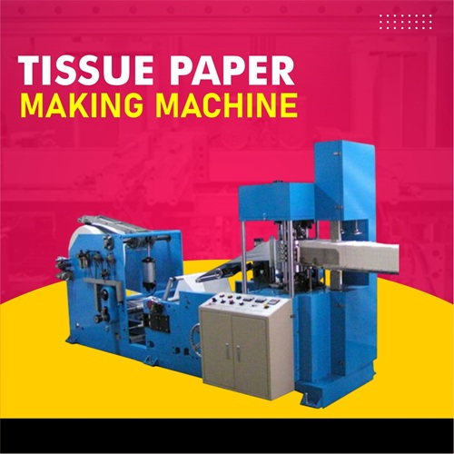

# ShouryaNapkins - Premium Tissue Products

<p align="center">
    
</p>

<p align="center">
    <strong>Crafting Excellence in Every Tissue Since 2022</strong>
</p>

<p align="center">
    <a href="#features">Features</a> •
    <a href="#installation">Installation</a> •
    <a href="#usage">Usage</a> •
    <a href="#documentation">Documentation</a> •
    <a href="#contact">Contact</a>
</p>

---

## About ShouryaNapkins

ShouryaNapkins is a premium tissue products manufacturer based in Mumbai, India. We specialize in producing high-quality, eco-friendly napkins and tissues using state-of-the-art manufacturing technology.

### Our Vision
To become India's leading premium tissue manufacturer by combining traditional craftsmanship with modern technology, sustainable practices, and uncompromising quality standards.

### Our Products
- **Paper Napkin Tissue** - Bulk packing, custom printing, multiple layers
- **Facial Tissue** - Hypoallergenic, lotion infused, ultra soft
- **Ultra Soft Facial Tissue** - 3-ply strength, scent-free, biodegradable

---

## Features

✨ **Modern Web Application**
- Built with Laravel 12.0 and PHP 8.2
- Responsive design with TailwindCSS 4.0
- Fast build system with Vite 7.0
- Smooth animations and transitions

🎨 **Beautiful UI/UX**
- Hero section with video background
- Animated statistics counters
- Interactive product gallery
- Embedded Google Maps for location
- Social media integration

📱 **Fully Responsive**
- Mobile-first design
- Touch-friendly interface
- Cross-browser compatibility
- Optimized for all devices

🚀 **Performance**
- Optimized asset loading
- Lazy loading images
- Cached configurations
- Fast page load times

♻️ **Eco-Friendly**
- 100% biodegradable materials
- Sustainable manufacturing
- ISO certified production

---

## Tech Stack

| Category | Technology |
|----------|------------|
| **Backend** | Laravel 12.0, PHP 8.2+ |
| **Frontend** | TailwindCSS 4.0, Vanilla JavaScript |
| **Build Tool** | Vite 7.0.7 |
| **Database** | SQLite / MySQL |
| **Animation** | AOS (Animate On Scroll) |
| **Icons** | Font Awesome 6.4.0 |
| **Gallery** | Fancybox 3.5.7 |

---

## Installation

### Prerequisites

Before you begin, ensure you have:
- **PHP** >= 8.2
- **Composer** (latest)
- **Node.js** >= 18.x
- **NPM** or Yarn
- **SQLite** or **MySQL** database

### Quick Start

```bash
# 1. Clone the repository
git clone https://github.com/anmol8070/ShouryaNapkins.git
cd ShouryaNapkins

# 2. Install PHP dependencies
composer install

# 3. Install Node dependencies
npm install

# 4. Setup environment
cp .env.example .env
php artisan key:generate

# 5. Setup database
touch database/database.sqlite
php artisan migrate

# 6. Build assets
npm run build

# 7. Start development server
composer run dev
```

The application will be available at **http://localhost:8000**

### Alternative: Manual Start

If you prefer to run services separately:

```bash
# Terminal 1: Laravel server
php artisan serve

# Terminal 2: Vite dev server
npm run dev

# Terminal 3: Queue worker (optional)
php artisan queue:listen

# Terminal 4: Log viewer (optional)
php artisan pail
```

---

## Usage

### Development

```bash
# Start all development services
composer run dev

# Run tests
composer run test

# Fix code style
./vendor/bin/pint
```

### Production Build

```bash
# Build optimized assets
npm run build

# Optimize Laravel
php artisan config:cache
php artisan route:cache
php artisan view:cache

# Install production dependencies
composer install --optimize-autoloader --no-dev
```

---

## Documentation

Comprehensive documentation is available in the following files:

- **[DOCUMENTATION.md](DOCUMENTATION.md)** - Complete project documentation
  - Installation & Setup
  - Configuration
  - Features
  - Deployment
  - Troubleshooting

- **[DEVELOPER_GUIDE.md](DEVELOPER_GUIDE.md)** - Developer quick reference
  - Common commands
  - Code examples
  - Best practices
  - Debugging tips

---

## Project Structure

```
ShouryaNapkins/
├── app/                    # Application code
│   ├── Http/              # Controllers & middleware
│   ├── Models/            # Eloquent models
│   └── Providers/         # Service providers
├── database/              # Database migrations & seeders
├── public/                # Public assets (CSS, JS, Images)
├── resources/             # Views, raw assets
│   ├── css/              # Source CSS
│   ├── js/               # Source JavaScript
│   └── views/            # Blade templates
├── routes/                # Route definitions
└── storage/               # Logs, cache, sessions
```

---

## Key Pages

| Page | Route | Description |
|------|-------|-------------|
| Homepage | `/` | Main landing page with all sections |

### Homepage Sections

1. **Hero Section** - Video showcase with call-to-action
2. **Statistics** - Company achievements and metrics
3. **About** - Company story and features
4. **Products** - Product catalog with details
5. **Gallery** - Manufacturing facility images
6. **Contact** - Contact information and map
7. **CTA** - Final call-to-action

---

## Features Breakdown

### 🎬 Hero Section
- Autoplay production video
- Animated floating particles
- Gradient background shapes
- Two CTA buttons (Explore Products, Get Quote)
- Feature badges (Eco-Friendly, Premium Quality, Bulk Orders)

### 📊 Statistics Section
- Animated counter on scroll
- 100+ Happy Customers
- 50+ Products Range
- 2+ Years Experience
- 100% Quality Assurance

### ℹ️ About Section
- Company story and mission
- Four key features with icons
- Manufacturing facility image
- ISO certification badge

### 📦 Products Section
- Three product categories
- Interactive hover effects
- Product features display
- Get Quote and View Details buttons

### 🖼️ Gallery Section
- Lightbox image viewer (Fancybox)
- Production line photos
- Quality check images
- Finished product showcase

### 📞 Contact Section
- Email, phone, website, address
- Embedded Google Maps
- WhatsApp, Call, Email quick actions
- Social media links (Instagram, Facebook, YouTube, LinkedIn)

---

## Environment Configuration

### Required Variables

```env
# Application
APP_NAME=ShouryaNapkins
APP_ENV=local
APP_DEBUG=true
APP_URL=http://localhost

# Database
DB_CONNECTION=sqlite
# DB_DATABASE=/absolute/path/to/database.sqlite

# Session & Queue
SESSION_DRIVER=database
QUEUE_CONNECTION=database
CACHE_STORE=database

# Mail
MAIL_MAILER=log
MAIL_FROM_ADDRESS="info@shouryanapkins.com"
MAIL_FROM_NAME="ShouryaNapkins"
```

---

## Commands Reference

### Artisan Commands

```bash
# Development
php artisan serve              # Start server
php artisan queue:listen       # Process queue jobs
php artisan pail              # View logs

# Database
php artisan migrate           # Run migrations
php artisan migrate:rollback  # Rollback migrations
php artisan db:seed          # Run seeders

# Cache
php artisan cache:clear      # Clear application cache
php artisan config:cache     # Cache configuration
php artisan route:cache      # Cache routes
php artisan view:cache       # Cache views

# Debugging
php artisan tinker           # Interactive shell
php artisan route:list       # List all routes
php artisan about            # Application info
```

### Composer Scripts

```bash
composer run dev             # Run all dev services
composer run test            # Run tests
composer run setup           # Setup project
```

### NPM Scripts

```bash
npm run dev                  # Start Vite dev server
npm run build                # Build for production
```

---

## Testing

```bash
# Run all tests
php artisan test

# Run specific test
php artisan test --filter ExampleTest

# Run with coverage
php artisan test --coverage
```

---

## Deployment

### Using Docker

```bash
# Build image
docker build -t shouryanapkins .

# Run container
docker run -p 8000:80 shouryanapkins
```

### Manual Deployment

1. Clone repository on server
2. Run `composer install --optimize-autoloader --no-dev`
3. Run `npm install && npm run build`
4. Configure `.env` for production
5. Run `php artisan migrate --force`
6. Set up web server (Nginx/Apache)
7. Configure SSL certificate

See [DOCUMENTATION.md](DOCUMENTATION.md) for detailed deployment instructions.

---

## Contributing

We welcome contributions! Please follow these steps:

1. Fork the repository
2. Create a feature branch (`git checkout -b feature/AmazingFeature`)
3. Commit your changes (`git commit -m 'Add some AmazingFeature'`)
4. Push to the branch (`git push origin feature/AmazingFeature`)
5. Open a Pull Request

### Code Style

- **PHP**: Follow PSR-12 standards, use Laravel Pint
- **JavaScript**: Use ES6+ syntax
- **CSS**: Follow BEM methodology where applicable

```bash
# Fix PHP code style
./vendor/bin/pint
```

---

## Troubleshooting

### Common Issues

**Issue: Blank page or 500 error**
```bash
php artisan config:clear
php artisan cache:clear
chmod -R 755 storage bootstrap/cache
```

**Issue: No application encryption key**
```bash
php artisan key:generate
```

**Issue: Database connection failed**
- Check `.env` database credentials
- Ensure SQLite file exists: `touch database/database.sqlite`
- Verify database service is running (for MySQL)

**Issue: Assets not loading**
```bash
npm run build
php artisan config:clear
```

See [DOCUMENTATION.md](DOCUMENTATION.md#troubleshooting) for more solutions.

---

## Security

If you discover any security vulnerabilities, please email us at **info@shouryanapkins.com**. All security vulnerabilities will be promptly addressed.

### Security Best Practices

- Keep dependencies updated
- Never commit `.env` file
- Use HTTPS in production
- Enable CSRF protection (enabled by default)
- Validate and sanitize all user input
- Regular security audits

---

## License

This project is proprietary software © 2022-2025 ShouryaNapkins. All rights reserved.

---

## Contact

**ShouryaNapkins**

- 📧 Email: [info@shouryanapkins.com](mailto:info@shouryanapkins.com)
- 🌐 Website: [www.shouryanapkins.com](https://shouryanapkins.com)
- 📱 Phone: [+91 98765 43210](tel:+919876543210)
- 📍 Address: 123 Industrial Area, Mumbai, Maharashtra - 400001
- 📸 Instagram: [@shourya_napkin_industries](https://www.instagram.com/shourya_napkin_industries)

---

## Acknowledgments

Built with ❤️ using:
- [Laravel](https://laravel.com) - The PHP Framework for Web Artisans
- [TailwindCSS](https://tailwindcss.com) - Utility-first CSS framework
- [Vite](https://vitejs.dev) - Next generation frontend tooling
- [Font Awesome](https://fontawesome.com) - Icon library
- [Fancybox](https://fancyapps.com) - Lightbox library
- [AOS](https://michalsnik.github.io/aos/) - Animate On Scroll library

---

<p align="center">
    <strong>Made with precision and care by ShouryaNapkins</strong><br>
    <em>Crafting Excellence in Every Tissue</em>
</p>

---

**Version:** 1.0.0  
**Last Updated:** December 4, 2025
